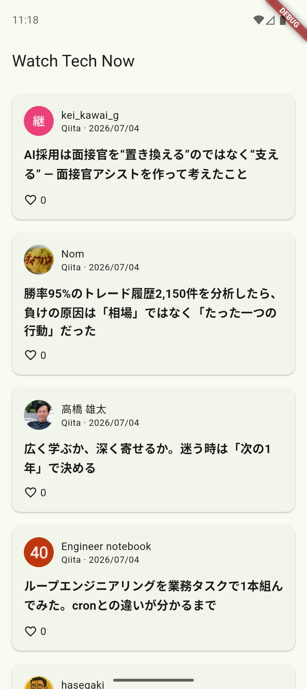

# Watch Tech Now

Zenn と Qiita の技術記事をまとめて閲覧する、Kotlin Multiplatform / Compose Multiplatform 製のモバイルアプリです。Android と iOS で UI とロジックを共有しています。



## 実装済みの機能

- Zenn と Qiita の新着記事を並行取得し、投稿日順に統合して表示
- 記事タイトル、投稿者、アイコン、投稿日、いいね数、提供元の表示
- ページネーションによる追加読み込み
- 通信エラー、API レート制限時のメッセージと再試行
- 一方のサービスで取得に失敗しても、もう一方の記事を表示するフォールトトレラントな構成
- Zenn / Qiita のキーワード検索に対応するデータ層と状態管理

現在の画面では記事一覧と追加読み込みを利用できます。検索 UI、記事詳細画面、元記事を開く導線は今後実装予定です。

## 対象プラットフォーム

- Android 8.0（API 26）以上
- iOS 14.0 以上
- Kotlin ターゲット: `androidTarget` / `iosArm64` / `iosSimulatorArm64`

## 技術スタック

- Kotlin 2.3.21
- Compose Multiplatform 1.11.1 / Material 3
- Ktor 3.3.3
- kotlinx.serialization / kotlinx.coroutines / kotlinx.datetime
- Koin 4.1.1
- Navigation Compose
- Coil 3

## アーキテクチャ

主要な UI、状態管理、ドメインモデル、データ取得処理は `composeApp/src/commonMain` に配置しています。

```text
Compose UI
    └── ArticlesViewModel
            └── ArticleRepository
                    └── AggregatingArticleRepository
                            ├── QiitaArticleRepository → Qiita API v2
                            └── ZennArticleRepository  → Zenn 非公式 API
```

プラットフォーム固有の HTTP エンジンには、Android で OkHttp、iOS で Darwin を使用します。

## 開発環境

- JDK 17
- Android Studio と Android SDK 36
- Xcode 16 以降（iOS のビルド時）
- Kotlin Multiplatform IDE plugin（推奨）

Android SDK が自動検出されない場合は、プロジェクト直下に `local.properties` を作成します。

```properties
sdk.dir=/path/to/Android/sdk
```

## ビルドと実行

### Android

macOS / Linux:

```shell
./gradlew :composeApp:assembleDebug
```

Windows:

```powershell
.\gradlew.bat :composeApp:assembleDebug
```

Android Studio では `composeApp` の Android 実行構成を選択し、実機またはエミュレータで起動できます。

### iOS

Simulator 用の Kotlin/Native framework をビルドします。

```shell
./gradlew :composeApp:linkDebugFrameworkIosSimulatorArm64
```

その後、`iosApp/iosApp.xcodeproj` を Xcode で開き、署名チームと Simulator を選択して `iosApp` スキームを実行します。Xcode の Build Phase が `ComposeApp` framework を生成して埋め込みます。

## テスト

共通コードのユニットテスト:

```shell
./gradlew :composeApp:allTests
```

Android の UI テスト:

```shell
./gradlew :composeApp:connectedDebugAndroidTest
```

Windows では `./gradlew` を `.\gradlew.bat` に読み替えてください。

## 外部 API と注意事項

- Qiita は公式の Qiita API v2 を認証なしで使用します。未認証時のレート制限があります。
- Zenn は非公式 API を使用するため、予告なく仕様変更または利用できなくなる可能性があります。
- API トークンなどの認証情報は保存しません。
- Android では平文 HTTP 通信を無効化し、iOS では App Transport Security の既定値を維持しています。

詳細な要件と既知のリスクは [`docs/requirements.md`](docs/requirements.md) を参照してください。
